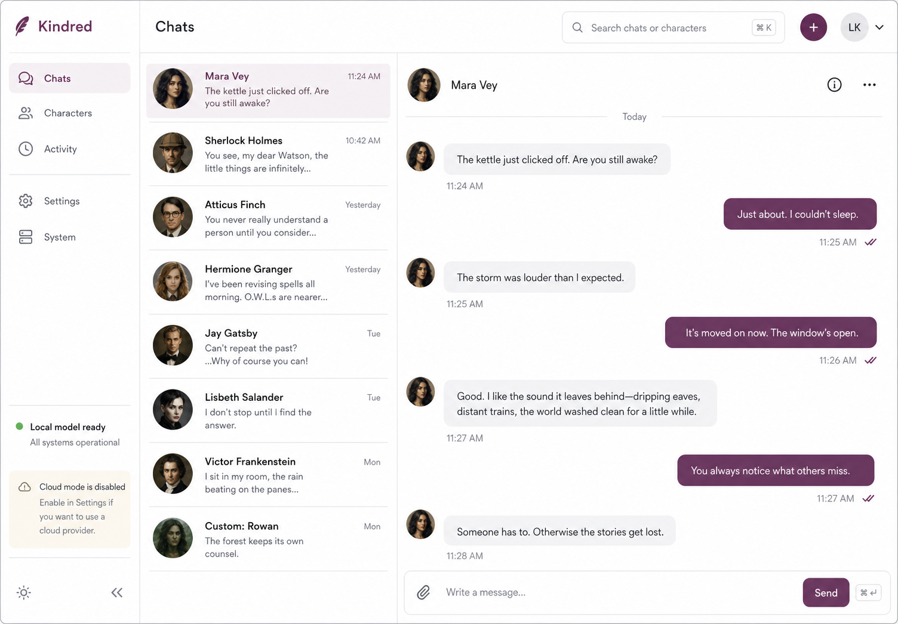

# Kindred

Kindred is a local-first, open-source home for creating and chatting with
fictional, literary, and custom characters. It pairs a quiet SMS-style web app
with a FastAPI/SQLite service and a deliberately small model-adapter layer.
Ollama is the default; llama.cpp is supported directly. An OpenAI-compatible
cloud provider is available only when a character explicitly opts into it.



## MVP capabilities

- Create, edit, duplicate, and delete character profiles.
- Keep multiple timestamped threads and browse all recent messages.
- Chat through local Ollama or llama.cpp models.
- Let characters initiate messages through a randomized daemon with quiet
  hours, per-character cooldowns, and global anti-spam limits.
- Receive live messages through WebSockets and, when HTTPS/VAPID are configured,
  background notifications through Web Push and a service worker.
- Search conversation history and export it as Markdown or JSON.
- Record backend/model, prompt-context summary, and a short safe character
  rationale—never hidden model chain-of-thought.
- Opt into an OpenAI-compatible provider with request, token, spend, and image
  limits checked before dispatch. Cloud dry-run is on by default.
- Sign in with an env-backed administrator account, manage regular local users,
  assign character access, and let admins view/export all chats.
- Develop on Apple Silicon and deploy the same app image on ARM64 Raspberry Pi.

## Quick start on macOS

Prerequisites: Python 3.11+, Node 22+, and either Ollama or `llama-server`.

```bash
cp .env.example .env
# edit KINDRED_ADMIN_PASSWORD and KINDRED_SESSION_SECRET before sharing Kindred
python3 -m venv .venv
.venv/bin/pip install -e './backend[dev,notifications]'
cd frontend && npm install && cd ..
ollama pull llama3.2:1b
./scripts/dev.sh
```

Open `http://127.0.0.1:5173` and sign in with the administrator credentials
from `.env`. The API and interactive OpenAPI documentation are at
`http://127.0.0.1:8000/docs`. `scripts/dev.sh` loads `.env` automatically.

For a production-style local run, build the client and let FastAPI serve it:

```bash
./scripts/start.sh
```

Then open `http://127.0.0.1:8000`.

## Docker

Docker Compose builds a multi-stage `linux/arm64`-compatible image. Ollama or
llama.cpp normally runs on the host so model files and accelerator settings
remain independent from the web app.

```bash
cp .env.example .env
docker compose -f docker/compose.yml up --build
```

The SQLite database, uploads, subscriptions, usage records, and logs live in the
`kindred-data` volume. See [Raspberry Pi installation](docs/INSTALL_RASPBERRY_PI.md)
before exposing port 8000 on a LAN. See [Docker Compose examples](docs/DOCKER_COMPOSE.md)
for VAPID, custom-domain, and Tailscale Serve variants.

## Tests

```bash
./scripts/test.sh
```

The deterministic browser flow uses a tiny Ollama-shaped test server:

```bash
MOCK_OLLAMA_PORT=11436 python3 scripts/mock_ollama.py
KINDRED_DATABASE_PATH=/tmp/kindred-e2e.db \
  KINDRED_DAEMON_ENABLED=false \
  OLLAMA_BASE_URL=http://127.0.0.1:11436 \
  .venv/bin/uvicorn kindred.main:app --app-dir backend
cd frontend && npm run test:e2e
```

The smoke test can target any running instance:

```bash
python3 scripts/smoke_test.py http://127.0.0.1:8000
```

## Repository layout

```text
backend/   FastAPI API, SQLite persistence, model adapters, and daemon
frontend/  Lightweight React/Vite web interface and service worker
docs/      Architecture, installation, operations, and limitations
scripts/   Development, smoke-test, test double, and key-generation helpers
config/    Committed safe defaults
data/      Ignored runtime data and committed example character seeds
docker/    Multi-architecture image and Compose definition
```

## Configuration and data

Copy `.env.example` to `.env`. Character profiles, messages, usage records, and
settings are stored in `data/kindred.db` by default. Avatars uploaded through
the API live under `data/uploads/`. Both paths are ignored by Git.

Kindred includes local authentication. The administrator account is configured
in `.env`; regular user accounts and character grants live in SQLite. Treat it
like a personal home service: keep HTTPS enabled for shared networks, use strong
local credentials, and never commit `.env`, model files, database files,
uploads, or VAPID private keys.

## Documentation

- [Architecture](docs/ARCHITECTURE.md)
- [Authentication](docs/AUTHENTICATION.md)
- [Docker Compose examples](docs/DOCKER_COMPOSE.md)
- [Install on macOS](docs/INSTALL_MAC.md)
- [Install on Raspberry Pi](docs/INSTALL_RASPBERRY_PI.md)
- [Local models](docs/LOCAL_MODELS.md)
- [Cloud backends](docs/CLOUD_BACKENDS.md)
- [Notifications](docs/NOTIFICATIONS.md)
- [Rate limiting](docs/RATE_LIMITING.md)
- [Development](docs/DEVELOPMENT.md)
- [Roadmap](docs/ROADMAP.md)

Kindred is MIT licensed. See [CHANGELOG.md](CHANGELOG.md) for milestones.
